# 🚴 Vellaro – Electric Bike App UI

Modern **electric bike mobile app UI/UX design** focused on stylish visuals, smooth navigation, and elegant branding.  
This project demonstrates a complete e‑bike shopping experience from browsing models to making a purchase.

---

## 📸 UI Preview

<table align="center">
  <tr>
    <td>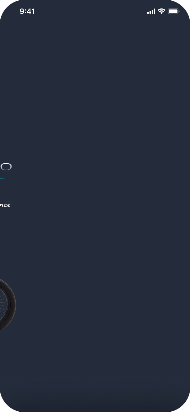</td>
    <td>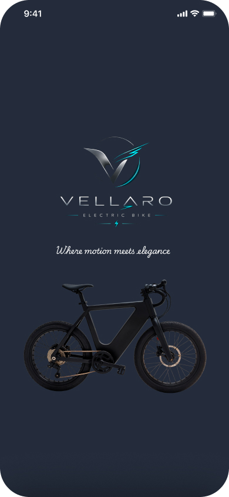</td>
  </tr>
  <tr>
    <td>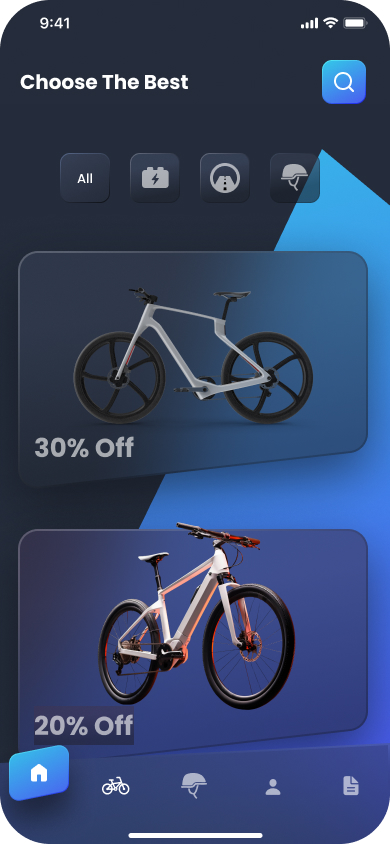</td>
    <td>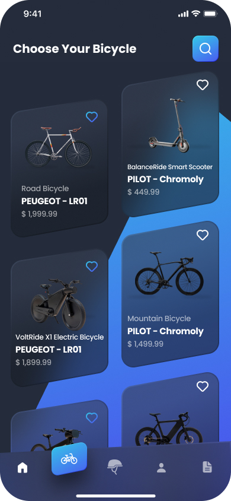</td>
  </tr>
  <tr>
    <td></td>
    <td>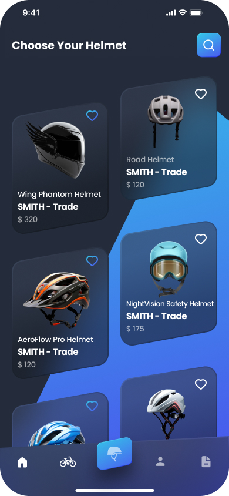</td>
  </tr>
  <tr>
    <td>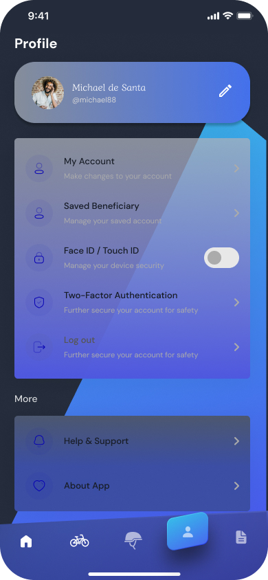</td>
    <td>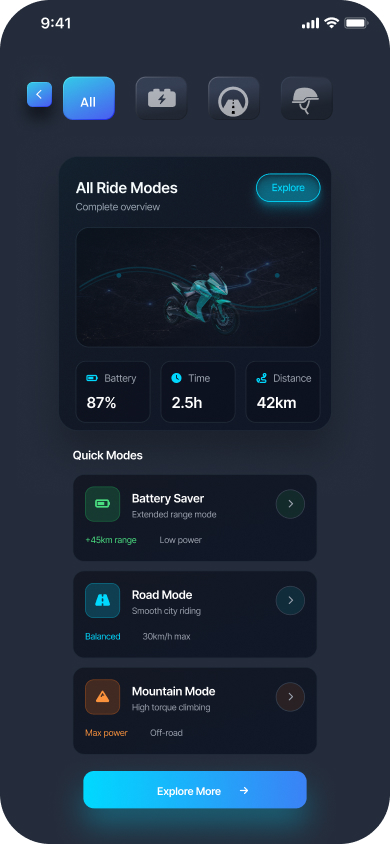</td>
  </tr>
  <tr>
    <td>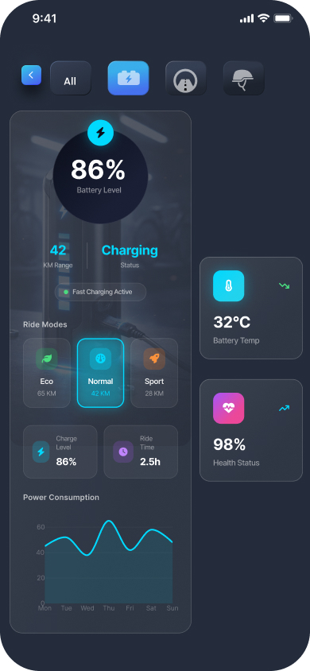</td>
    <td>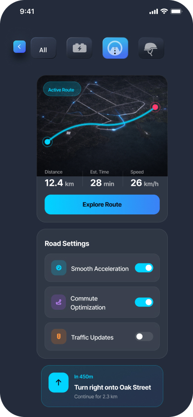</td>
  </tr>
  <tr>
    <td>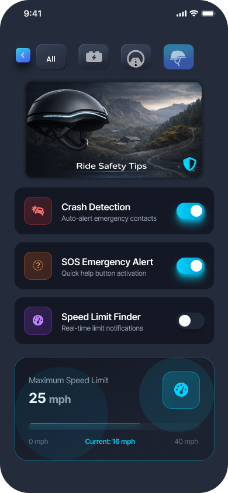</td>
    <td></td>
  </tr>
  <tr>
    <td>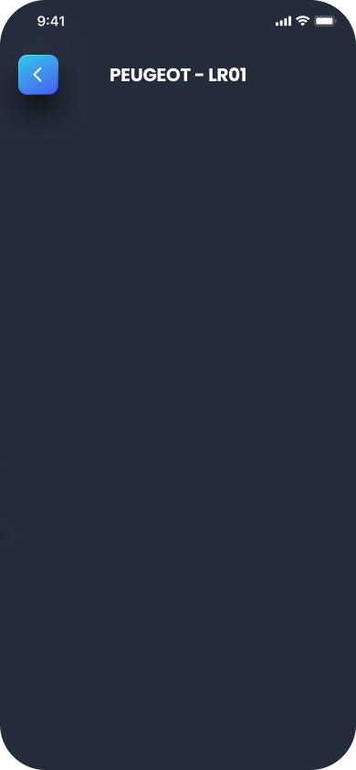</td>
    <td>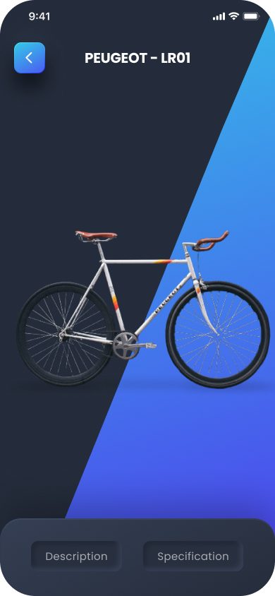</td>
  </tr>
  <tr>
    <td>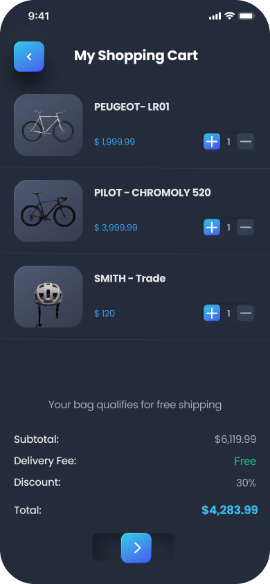</td>
    <td></td>
  </tr>
  <tr>
    <td></td>
    <td>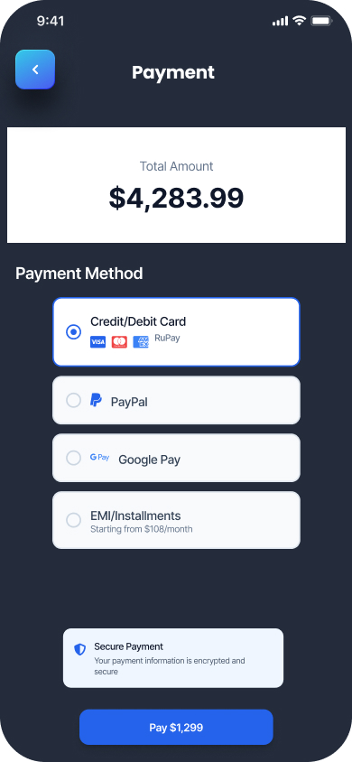</td>
  </tr>
  <tr>
    <td colspan="2">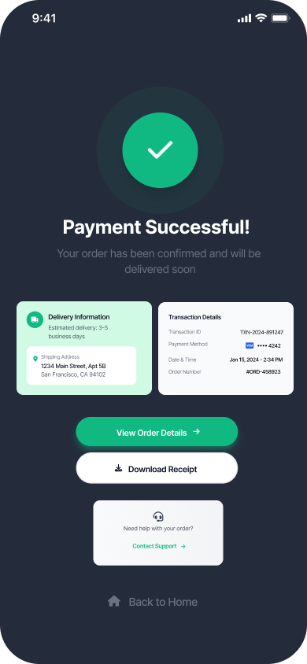</td>
  </tr>
</table>

---

## ✨ Features

- 🚴 Electric bike catalog browsing  
- 🎨 Modern and elegant UI design  
- ⚡ Filter options (all, electric, accessories, offers)  
- 💳 Order summary and checkout flow  
- 👤 User profile management  
- 💬 Customer support integration

---

## 🛠 Tools Used

- Figma  
- UI/UX Design Principles  
- Mobile Interface Design  

---

## 📌 Project Purpose

This project was created to practice and showcase **mobile UI/UX design skills** by designing a modern e‑bike shopping application interface.

---

⭐ If you like this project, feel free to star the repository.
